# SPKT Digital — Penjelasan Flow & Proses Aplikasi (Lengkap)

Dokumen ini menjelaskan **secara rinci** bagaimana aplikasi SPKT Digital berjalan: dari arsitektur teknis, hak akses per role, alur setiap layanan, perhitungan CSI, notifikasi, hingga skenario uji untuk penelitian.

**Versi:** sesuai implementasi kode di repository ini.

---

## Daftar Isi

1. [Ringkasan Eksekutif](#1-ringkasan-eksekutif)
2. [Stack Teknologi](#2-stack-teknologi)
3. [Cara Aplikasi Berjalan (Runtime)](#3-cara-aplikasi-berjalan-runtime)
4. [Arsitektur & Struktur Kode](#4-arsitektur--struktur-kode)
5. [Autentikasi & Keamanan Sesi](#5-autentikasi--keamanan-sesi)
6. [Peran, Hak Akses & Navigasi](#6-peran-hak-akses--navigasi)
7. [Panduan Menu & Penggunaan Aplikasi](#7-panduan-menu--penggunaan-aplikasi)
8. [Nomor Referensi Layanan](#8-nomor-referensi-layanan)
9. [Flow Laporan Polisi (Detail)](#9-flow-laporan-polisi-detail)
10. [Flow Layanan Surat (Detail)](#10-flow-layanan-surat-detail)
11. [Flow Pengaduan (Detail)](#11-flow-pengaduan-detail)
12. [Flow CSI — Kepuasan Masyarakat (Detail)](#12-flow-csi--kepuasan-masyarakat-detail)
13. [Flow Notifikasi](#13-flow-notifikasi)
14. [Flow Admin & Manajemen](#14-flow-admin--manajemen)
15. [Upload File & Lampiran](#15-upload-file--lampiran)
16. [Informasi, Pengaturan & Preferensi](#16-informasi-pengaturan--preferensi)
17. [Model Data & Tabel Database](#17-model-data--tabel-database)
18. [Kontrak API (Ringkas per Role)](#18-kontrak-api-ringkas-per-role)
19. [Deploy, Environment & Build](#19-deploy-environment--build)
20. [Skenario Uji Lengkap (Penelitian)](#20-skenario-uji-lengkap-penelitian)
21. [Referensi File Kode](#21-referensi-file-kode)

---

## 1. Ringkasan Eksekutif

**SPKT Digital** (*Sistem Pelayanan Kepolisian Terpadu*) adalah aplikasi web untuk:

| Fungsi | Deskripsi |
|--------|-----------|
| **Laporan polisi online** | Masyarakat membuat laporan kejadian, melacak status, melihat timeline |
| **Layanan surat** | Pengajuan SKCK, surat kehilangan, izin keramaian |
| **Pengaduan** | Keluhan/saran terhadap pelayanan SPKT |
| **CSI** | Survei kepuasan masyarakat setelah layanan selesai |
| **Manajemen petugas** | Petugas memproses layanan; admin mengelola user & statistik |

Aplikasi berjalan sebagai **Single Page Application (SPA)** di dalam Next.js: satu halaman `/` dengan navigasi internal `/?view=nama-menu`, backend REST di `/api/*`, data disimpan di **SQLite** lokal.

---

## 2. Stack Teknologi

| Komponen | Teknologi | Keterangan |
|----------|-----------|------------|
| Framework | Next.js 15 (App Router) | SSR/SSG + API Routes |
| UI | React 19 + Tailwind CSS | Komponen di `src/components/` |
| Database | SQLite (`node:sqlite`) | File `data/spkt.db`, WAL mode |
| Auth | Cookie session | `spkt_session`, 7 hari |
| Chart CSI | Recharts | `AdminCSI.tsx` |
| Upload | Multipart → filesystem | `data/uploads/` |

**Persyaratan Node.js:** >= 22.5.0 (fitur `node:sqlite`).

---

## 3. Cara Aplikasi Berjalan (Runtime)

### 3.1 Diagram siklus hidup lengkap

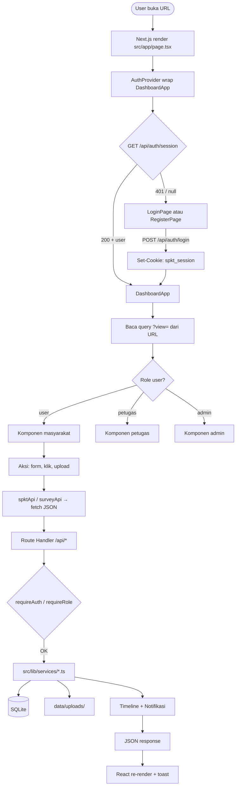

### 3.2 Urutan teknis per tahap

| # | Tahap | Apa yang terjadi | File / endpoint |
|---|-------|------------------|-----------------|
| 1 | **Initial load** | Browser memuat bundle React + layout | `src/app/layout.tsx`, `page.tsx` |
| 2 | **Hydration** | `AuthProvider` mount, `loading=true` | `AuthContext.tsx` |
| 3 | **Session check** | `GET /api/auth/session` baca cookie, join `sessions` + `users` | `auth-server.ts` |
| 4 | **Timeout fallback** | Jika API > 8 detik, anggap tidak login | `AuthContext.tsx` baris 71–76 |
| 5 | **Gate UI** | `!isAuthenticated` → `LoginPage`; else → dashboard | `DashboardApp.tsx` |
| 6 | **Default view** | Jika URL tanpa `?view=`, redirect ke `?view=dashboard` | `DashboardApp.tsx` useEffect |
| 7 | **Render view** | `switch(currentView)` × `switch(user.role)` | `DashboardApp.tsx` |
| 8 | **User action** | Komponen panggil `spktApi.createReport()` dll. | `spktApi.ts` |
| 9 | **API handler** | Validasi body → service layer → DB | `src/app/api/**/route.ts` |
| 10 | **Init DB** | Pertama kali API jalan: `ensureDbReady()` buat tabel + seed | `db.ts` |
| 11 | **Side effects** | Ubah status → timeline + notifikasi ke NIK pelapor | `spkt.ts`, `notifications.ts` |
| 12 | **Polling notif** | `NotificationBell` refresh tiap 30 detik | `NotificationBell.tsx` |

### 3.3 Inisialisasi database

Saat runtime (bukan saat `next build`):

1. `ensureDbReady()` dipanggil dari service layer
2. Tabel dibuat (`CREATE TABLE IF NOT EXISTS`)
3. Migrasi kolom baru (`migrateSchema()` — mis. `preferences_json`)
4. Seed data demo jika tabel `users` kosong
5. File DB: `DATA_DIR/spkt.db` (default `./data/spkt.db`)

> **Build production:** Koneksi SQLite **dilewati** saat `NEXT_PHASE=phase-production-build` agar worker paralel Next.js tidak lock database (lihat `db.ts` → `isDatabaseDisabled()`).

---

## 4. Arsitektur & Struktur Kode

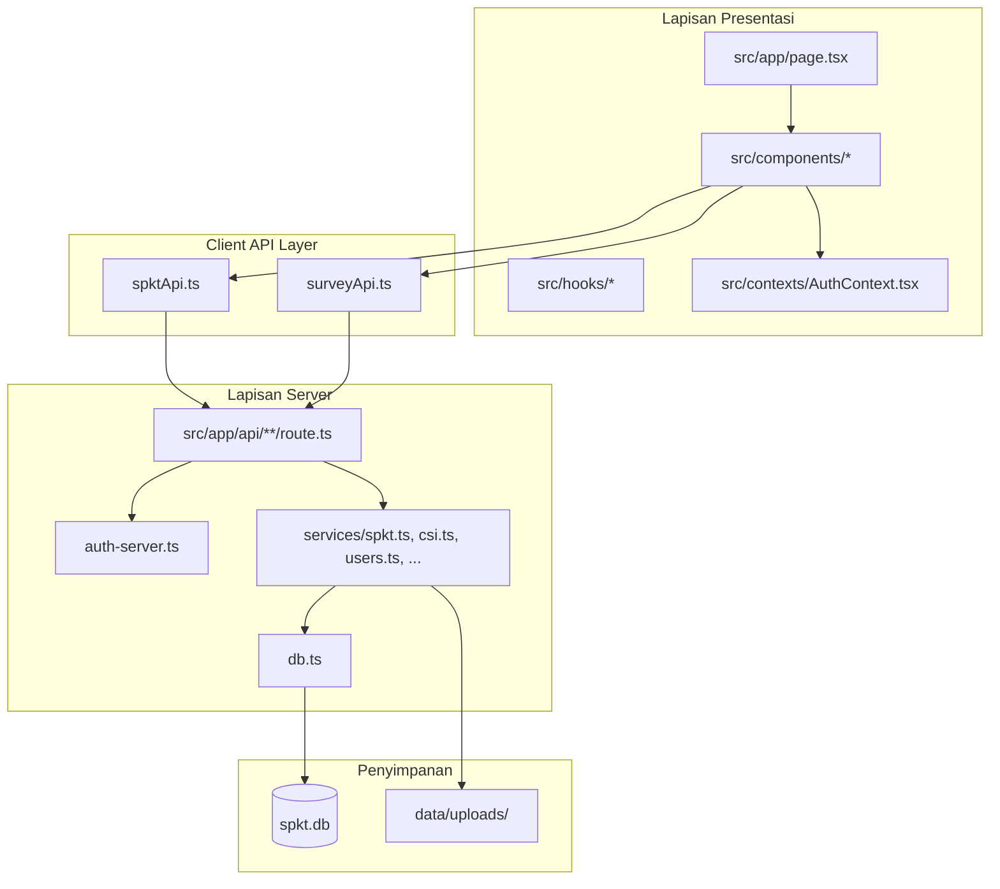

### Struktur folder penting

```
src/
├── app/
│   ├── page.tsx              # Entry: DashboardApp + Suspense
│   ├── layout.tsx            # Root layout, AuthProvider
│   └── api/                  # REST endpoints
├── components/               # UI per fitur & role
├── contexts/AuthContext.tsx  # State login global
├── hooks/                    # useReports, useCsiEligibility, ...
└── lib/
    ├── db.ts                 # Schema + seed SQLite
    ├── csi.ts                # Logika CSI
    ├── auth-server.ts        # Session server-side
    ├── spktApi.ts            # Client HTTP wrapper
    ├── status-transitions.ts # Aturan ubah status
    └── services/             # Business logic
data/
├── spkt.db                   # Database (auto-created)
└── uploads/                  # File lampiran
docs/
├── penjelasan.md             # Dokumen ini
├── FLOW.md                   # Ringkasan flow
└── API.md                    # Kontrak API
```

---

## 5. Autentikasi & Keamanan Sesi

### 5.1 Diagram login

```mermaid
sequenceDiagram
    participant B as Browser
    participant UI as LoginPage
    participant API as POST /api/auth/login
    participant DB as SQLite

    B->>UI: email + password
    UI->>API: JSON body
    API->>DB: SELECT user WHERE email=?
    API->>DB: bcrypt verify password
    API->>DB: INSERT sessions (token UUID, expires 7 hari)
    API-->>B: Set-Cookie spkt_session=token; HttpOnly
    UI->>UI: AuthContext setUser → DashboardApp
```

### 5.2 Detail session

| Aspek | Nilai | Lokasi |
|-------|-------|--------|
| Nama cookie | `spkt_session` | `auth-server.ts` |
| Durasi | 7 hari | `SESSION_MAX_AGE_SEC` |
| Penyimpanan | Tabel `sessions` | `db.ts` |
| Validasi | Setiap request API memanggil `getSessionUserFromRequest()` | route handlers |
| Logout | Hapus baris session + clear cookie | `POST /api/auth/logout` |

### 5.3 Register

- Endpoint: `POST /api/auth/register`
- Role otomatis: **`user`** (masyarakat)
- Setelah sukses: langsung login (session dibuat)
- Field wajib: email, password, name, NIK, phone

### 5.4 Akun bawaan (seed database)

| Role | Email | Password | Nama (seed) |
|------|-------|----------|-------------|
| Masyarakat | `user@spkt.id` | `spkt123` | Budi Santoso |
| Petugas | `petugas@spkt.id` | `spkt123` | Ipda. Ahmad Wijaya |
| Admin | `admin@spkt.id` | `spkt123` | Kompol. Sarah Putri |

---

## 6. Peran, Hak Akses & Navigasi

### 6.1 Matriks hak akses fitur

| Fitur | Masyarakat | Petugas | Admin |
|-------|:----------:|:-------:|:-----:|
| Buat laporan | ✅ | ❌ | ❌ |
| Lihat laporan sendiri (NIK) | ✅ | ❌ | ❌ |
| Laporan masuk / proses | ❌ | ✅ | ✅ (Semua Laporan) |
| Override status laporan | ❌ | ❌ | ✅ |
| Reassign petugas | ❌ | ❌ | ✅ |
| Ajukan surat | ✅ | ❌ | ❌ |
| Kelola status surat | ❌ | ✅ | ✅ |
| Buat pengaduan | ✅ | ❌ | ❌ |
| Tanggapi pengaduan | ❌ | ✅ | ✅ |
| Isi CSI | ✅ (layanan sendiri) | ❌ | ❌ |
| Dashboard CSI / statistik | ❌ | ❌ | ✅ |
| User management | ❌ | ❌ | ✅ |
| Kelola petugas | ❌ | ❌ | ✅ |
| Informasi & pengaturan | ✅ | ✅ | ✅ |

### 6.2 Menu sidebar per role

Navigasi via query URL — contoh: `/?view=complaints`

| `?view=` | Label menu | Role |
|----------|------------|------|
| `dashboard` | Dashboard | semua |
| `create-report` | Buat Laporan | user |
| `my-reports` | Laporan Saya | user |
| `incoming-reports` | Laporan Masuk | petugas |
| `all-reports` | Semua Laporan | admin |
| `letter-service` | Layanan Surat | semua |
| `complaints` | Pengaduan | semua |
| `user-management` | User Management | admin |
| `officer-management` | Kelola Petugas | admin |
| `statistics` | Statistik | admin |
| `csi-dashboard` | Kepuasan (CSI) | admin |
| `information` | Informasi | semua |
| `settings` | Pengaturan | semua |

### 6.3 Mapping view → komponen React

| View | Komponen | File |
|------|----------|------|
| `dashboard` | UserDashboard / OfficerDashboard / AdminDashboard | masing-masing file |
| `create-report` | CreateReport | `CreateReport.tsx` |
| `my-reports` | MyReports | `MyReports.tsx` |
| `incoming-reports` | OfficerDashboard | `OfficerDashboard.tsx` |
| `all-reports` | AdminControl | `AdminControl.tsx` |
| `letter-service` | LetterService | `LetterService.tsx` |
| `complaints` | Complaints | `Complaints.tsx` |
| `user-management` | AdminUserManagement | `AdminUserManagement.tsx` |
| `officer-management` | AdminOfficerManagement | `AdminOfficerManagement.tsx` |
| `statistics` | AdminStatistics | `AdminStatistics.tsx` |
| `csi-dashboard` | AdminCSI | `AdminCSI.tsx` |
| `information` | Information | `Information.tsx` |
| `settings` | Settings | `Settings.tsx` |

### 6.4 UI mobile vs desktop

| Elemen | Desktop | Mobile |
|--------|---------|--------|
| Menu | Sidebar tetap kiri | Sheet (hamburger) via `MobileHeader` |
| Logo | Sidebar dengan teks SPKT Digital | Header compact, emblem saja |
| Konten | `main` scroll dengan scrollbar biru | Sama, full width |

> **Panduan praktis:** untuk langkah demi langkah memakai setiap menu (tombol, form, popup), lihat [Bab 7 — Panduan Menu & Penggunaan Aplikasi](#7-panduan-menu--penggunaan-aplikasi).

---

## 7. Panduan Menu & Penggunaan Aplikasi

Bab ini menjelaskan **cara pakai aplikasi dari sisi pengguna**: tampilan layar, isi setiap menu, tombol yang tersedia, dan langkah demi langkah untuk menyelesaikan layanan. Untuk alur teknis/backend, lihat bab [8–12](#8-nomor-referensi-layanan).

### 7.1 Tampilan umum setelah login

Setelah berhasil masuk, semua role melihat layout yang sama dengan konten berbeda:

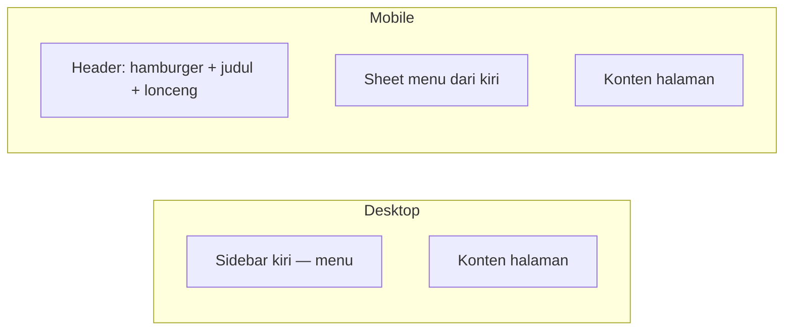

| Area | Fungsi | Cara pakai |
|------|--------|------------|
| **Sidebar** (desktop, lebar ~256px) | Daftar menu sesuai role | Klik item menu → URL berubah ke `/?view=nama-menu` |
| **Sheet menu** (mobile) | Sidebar yang disembunyikan | Tap ikon **☰** di header → pilih menu → sheet otomatis tertutup |
| **Header mobile** | Judul halaman aktif + notifikasi | Subjudul menampilkan label menu (mis. *Laporan Saya*) |
| **Lonceng notifikasi** | Pemberitahuan status layanan | Tap lonceng → baca daftar → tap item untuk buka halaman terkait |
| **Footer sidebar** | Info akun + keluar | Nama, email, badge role; tombol **Keluar** menghapus session |

**Notifikasi:** badge merah di lonceng menunjukkan jumlah belum dibaca. Tap **Tandai semua dibaca** untuk membersihkan counter. Daftar diperbarui otomatis setiap 30 detik.

**Navigasi URL:** bookmark atau share link `/?view=my-reports` langsung membuka menu *Laporan Saya* (setelah login).

---

### 7.2 Masuk, daftar, dan keluar

#### Login

1. Buka aplikasi → halaman login dengan logo SPKT Digital.
2. Isi **Email** dan **Password** → klik **Masuk**, atau klik tombol **User** / **Petugas** / **Admin** di bagian **Login:** untuk mengisi form otomatis lalu klik **Masuk**.
3. Jika salah, muncul pesan *Email atau password salah*.

#### Registrasi (masyarakat baru)

1. Di halaman login, klik **Daftar sekarang**.
2. Lengkapi: **Nama**, **Email**, **NIK**, **Telepon**, **Password**, **Konfirmasi Password**.
3. Password minimal 6 karakter; konfirmasi harus sama.
4. Setelah sukses, langsung masuk sebagai role **user** (masyarakat).

#### Keluar

Di bagian bawah sidebar: klik **Keluar** → kembali ke halaman login; cookie session dihapus.

---

### 7.3 Panduan Masyarakat (`role: user`)

Menu yang tersedia: **Dashboard**, **Buat Laporan**, **Laporan Saya**, **Layanan Surat**, **Pengaduan**, **Informasi**, **Pengaturan**.

#### 7.3.1 Dashboard

Halaman ringkasan aktivitas pribadi.

| Bagian | Isi | Aksi |
|--------|-----|------|
| **Kartu statistik** | Total laporan, sedang diproses, selesai, jumlah surat | Informasi saja |
| **Aksi Cepat** | 3 shortcut | **Buat Laporan** / **Ajukan Surat** / **Lacak Status** → pindah menu |
| **Laporan Terbaru** | 3 laporan terakhir + badge status | **Detail** atau **Lihat Semua** → *Laporan Saya* |
| **Alert hijau** | Muncul jika ada surat status *Siap Diambil* | **Lihat detail** → *Layanan Surat* |

#### 7.3.2 Buat Laporan (`/?view=create-report`)

**Langkah mengirim laporan:**

1. Menu **Buat Laporan** (atau Aksi Cepat di dashboard).
2. Isi **Data Pelapor** — nama, NIK, telepon (prefill dari profil).
3. Isi **Detail Kejadian** — jenis kasus, tanggal kejadian, lokasi, uraian.
4. (Opsional) **Unggah bukti** — drag & drop atau pilih file di zona upload.
5. Pilih salah satu:
   - **Kirim Laporan** → laporan masuk antrian petugas; tampil layar sukses + **nomor laporan** (simpan nomor ini).
   - **Simpan Draft** → disimpan tanpa dikirim; lanjut nanti dari *Laporan Saya*.

**Setelah terkirim:** layar hijau menampilkan nomor laporan. Tombol **Lihat Laporan Saya** atau **Kembali ke Dashboard**.

> **Penting:** laporan palsu dapat dikenakan sanksi — peringatan ditampilkan di atas form.

#### 7.3.3 Laporan Saya (`/?view=my-reports`)

**Melacak status:**

1. Gunakan **kotak cari** — nomor laporan atau jenis kasus.
2. Filter chip: **Semua** / **Proses** / **Selesai**.
3. Klik baris laporan → **popup detail** berisi:
   - Data pelapor & kejadian
   - **Timeline** progres (ikon centang = tahap selesai)
   - Lampiran bukti (jika ada)
4. Status **Draft** → tombol **Lanjutkan Draft** membuka form *Buat Laporan* dengan data terisi.
5. Status **Selesai** + belum isi survei → tombol **Berikan Penilaian (CSI)** muncul di popup.

#### 7.3.4 Layanan Surat (`/?view=letter-service`)

**Mengajukan surat baru:**

1. Pilih jenis kartu: **SKCK**, **Surat Kehilangan**, **Izin Keramaian**, dll.
2. Form terbuka — isi tujuan pengajuan, tanggal pengambilan (opsional), lampiran persyaratan.
3. **Ajukan** → toast sukses; pengajuan muncul di daftar bawah.

**Melacak pengajuan:**

- Setiap baris menampilkan nomor permohonan, jenis surat, badge status.
- Klik baris → popup detail + timeline status.
- Status **Siap Diambil** atau **Selesai** → bisa isi **CSI** dari popup.

**Status yang mungkin dilihat masyarakat:**

| Status | Arti untuk user |
|--------|-----------------|
| Diajukan | Baru masuk, menunggu verifikasi |
| Diverifikasi | Petugas memeriksa kelengkapan |
| Siap Diambil | Surat bisa diambil di kantor (bawa identitas) |
| Selesai | Proses administratif selesai |
| Ditolak | Lihat alasan penolakan di detail |

#### 7.3.5 Pengaduan (`/?view=complaints`)

**Membuat pengaduan:**

1. Klik **Buat Pengaduan Baru**.
2. Pilih **Kategori** (pelayanan, waktu tunggu, petugas, fasilitas, lainnya).
3. Isi **Subjek** dan **Uraian**; lampirkan file jika perlu.
4. **Kirim Pengaduan** → nomor pengaduan otomatis dibuat.

**Melacak:**

- Cari via kotak pencarian (subjek / nomor).
- Klik item → lihat status, tanggapan petugas (jika sudah ada), lampiran.
- Status **Selesai** / **Ditutup** → tombol **CSI** tersedia.

#### 7.3.6 Informasi (`/?view=information`)

Tiga tab:

| Tab | Isi | Cara pakai |
|-----|-----|------------|
| **Artikel & Panduan** | Artikel dari API (panduan layanan, edukasi) | Cari judul; filter kategori: Panduan, Layanan, Edukasi, Peringatan |
| **Kontak** | Hotline 110, WhatsApp, email, alamat kantor | Salin/hubungi sesuai kebutuhan |
| **FAQ** | Pertanyaan umum | Tap pertanyaan untuk expand jawaban |

#### 7.3.7 Pengaturan (`/?view=settings`)

Empat tab:

| Tab | Yang bisa diubah | Catatan |
|-----|------------------|---------|
| **Profil** | Nama, telepon, alamat, foto avatar | Email & NIK read-only; **Simpan Profil** |
| **Notifikasi** | Email, push, SMS, update laporan, surat siap, berita sistem | Toggle switch → **Simpan Preferensi** |
| **Keamanan** | Ganti password | Password lama + baru + konfirmasi |
| **Tampilan** | Mode gelap / terang | Disimpan ke preferensi user |

---

### 7.4 Panduan Petugas (`role: petugas`)

Menu: **Dashboard**, **Laporan Masuk**, **Layanan Surat**, **Pengaduan**, **Informasi**, **Pengaturan**.

#### 7.4.1 Dashboard petugas

Mirip dashboard admin ringkas — statistik laporan masuk dan aktivitas. Gunakan shortcut ke **Laporan Masuk** untuk mulai bekerja.

#### 7.4.2 Laporan Masuk (`/?view=incoming-reports`)

**Alur kerja harian:**

1. Lihat **kartu statistik**: belum ditugaskan, ditugaskan ke saya, sedang diproses, selesai.
2. Tab/section **Belum Ditugaskan** — laporan baru dari masyarakat.
3. Klik laporan → popup detail.
4. Aksi di popup:
   - **Verifikasi** — konfirmasi laporan valid (+ catatan opsional).
   - **Ambil Tugas** — assign ke diri sendiri.
   - **Ubah Status** — pilih status (processing, completed, dll.) + catatan timeline.
5. Setelah **Selesai**, masyarakat menerima notifikasi dan bisa mengisi CSI.

#### 7.4.3 Layanan Surat (tampilan petugas)

Daftar **semua** pengajuan surat (bukan hanya milik sendiri).

1. Klik pengajuan → **Kelola** / popup manajemen.
2. Ubah **Status** (verified → ready → completed, atau rejected).
3. Isi **Tanggal pengambilan** jika surat siap.
4. Jika menolak, isi **Alasan penolakan**.
5. **Simpan** → user mendapat notifikasi perubahan status.

#### 7.4.4 Pengaduan (tampilan petugas)

Daftar semua pengaduan masyarakat.

1. Klik pengaduan → popup detail.
2. Ubah **Status** (submitted → in_progress → resolved → closed).
3. Tulis **Tanggapan/respon** untuk pengadu.
4. **Simpan** → respon terlihat di sisi masyarakat.

---

### 7.5 Panduan Admin (`role: admin`)

Menu lengkap termasuk manajemen dan analitik.

#### 7.5.1 Dashboard admin

Grafik dan angka agregat: total laporan, tingkat penyelesaian, distribusi jenis kasus, tren bulanan, bucket waktu respon. Dipakai untuk monitoring cepat sebelum buka menu detail.

#### 7.5.2 Semua Laporan (`/?view=all-reports`)

Supervisi seluruh laporan di sistem.

| Aksi admin | Kapan dipakai |
|------------|---------------|
| Lihat semua laporan + filter | Audit / eskalasi |
| **Override status** | Koreksi status yang salah |
| **Reassign petugas** | Alihkan ke petugas lain |
| Timeline penuh | Jejak setiap perubahan |

#### 7.5.3 User Management (`/?view=user-management`)

- Daftar semua akun terdaftar.
- **Aktifkan / Nonaktifkan** — user nonaktif tidak bisa login.
- **Ubah role** — masyarakat ↔ petugas ↔ admin (via dialog edit).

#### 7.5.4 Kelola Petugas (`/?view=officer-management`)

- Daftar khusus akun ber-role petugas.
- Tambah petugas baru atau kelola data petugas existing (nama, kontak, status aktif).

#### 7.5.5 Statistik (`/?view=statistics`)

Dashboard analitik dedicated — chart laporan, penyelesaian, distribusi kasus. Lebih detail dari widget dashboard utama.

#### 7.5.6 Kepuasan CSI (`/?view=csi-dashboard`)

- Grafik skor kepuasan per layanan (laporan, surat, pengaduan).
- Rata-rata CSI, jumlah responden, tren waktu.
- Dipakai evaluasi kualitas pelayanan SPKT.

Admin juga bisa **mengelola surat** dan **menanggapi pengaduan** sama seperti petugas (lihat §7.4.3–7.4.4).

---

### 7.6 Elemen UI yang dipakai di banyak menu

| Elemen | Perilaku | Tips |
|--------|----------|------|
| **Popup (Dialog)** | Detail laporan/surat/pengaduan | Scrollable di mobile (`max-h` ~90% layar); tutup dengan X atau klik luar |
| **Toast** | Notifikasi singkat sukses/gagal | Muncul pojok layar setelah simpan/kirim |
| **Badge status** | Warna berbeda per status | Hover/klik baris untuk arti lengkap di popup |
| **FileUploadZone** | Drag-drop multi file | Format umum: JPG, PNG, PDF; unggah saat submit |
| **CsiPromptButton** | Form bintang 1–5 + komentar | Hanya muncul jika layanan selesai & belum pernah isi CSI |
| **DatePickerField** | Pilih tanggal kejadian/pengambilan | Tap field → kalender |

---

### 7.7 Alur singkat per kebutuhan user

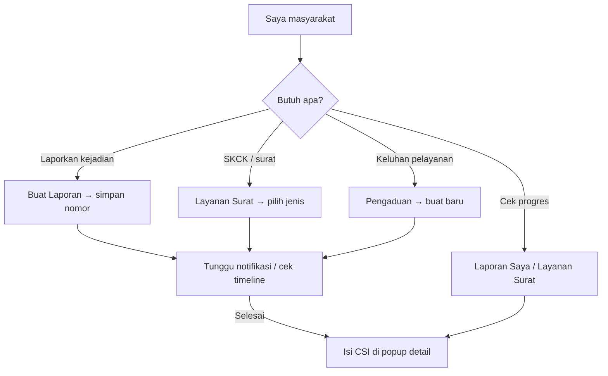

| Saya ingin… | Buka menu | Langkah utama |
|-------------|-----------|---------------|
| Melapor pencurian | Buat Laporan | Isi form → Kirim → catat nomor |
| Cek laporan kemarin | Laporan Saya | Cari nomor → buka timeline |
| Ajukan SKCK | Layanan Surat | Pilih SKCK → lampiran → Ajukan |
| Komplain antrean lama | Pengaduan | Kategori + uraian → Kirim |
| Tanya syarat dokumen | Informasi | Tab FAQ / Artikel |
| Ganti password | Pengaturan | Tab Keamanan |
| Proses laporan baru (petugas) | Laporan Masuk | Verifikasi → Ambil tugas → Selesai |
| Nonaktifkan akun | User Management (admin) | Toggle aktif |

---

### 7.8 Checklist pertama kali pakai aplikasi

**Masyarakat**

- [ ] Daftar akun atau login
- [ ] Lengkapi profil di Pengaturan
- [ ] Buat satu laporan uji atau ajukan surat
- [ ] Buka Laporan Saya / Layanan Surat untuk lacak status
- [ ] Aktifkan notifikasi email/push di Pengaturan
- [ ] Setelah layanan selesai, isi CSI

**Petugas**

- [ ] Login
- [ ] Buka Laporan Masuk → verifikasi & selesaikan satu laporan
- [ ] Ubah status satu pengajuan surat ke *Siap Diambil*
- [ ] Tanggapi satu pengaduan

**Admin**

- [ ] Login
- [ ] Review Semua Laporan & Statistik
- [ ] Cek dashboard CSI
- [ ] Uji suspend/aktifkan user di User Management

---

## 8. Nomor Referensi Layanan

Setiap layanan mendapat nomor unik otomatis dari `reference_counters` (transaksi aman `BEGIN IMMEDIATE`).

### Format

```
{PREFIX}/{SEQ}/V/{TAHUN}
```

| Layanan | Prefix | Contoh |
|---------|--------|--------|
| Laporan polisi | `LP` | `LP/001/V/2026` |
| SKCK | `SKCK` | `SKCK/001/V/2026` |
| Surat kehilangan | `SKH` | `SKH/002/V/2026` |
| Izin keramaian | `IZIN` | `IZIN/001/V/2026` |
| Pengaduan | `ADU` | `ADU/001/V/2026` |

Implementasi: `src/lib/reference.ts`

---

## 9. Flow Laporan Polisi (Detail)

### 9.1 State machine resmi

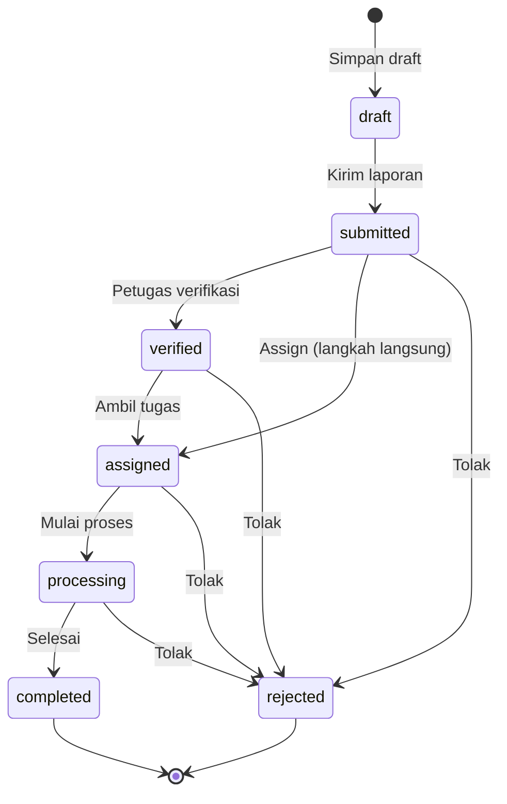

Aturan validasi: `canTransitionReport()` di `status-transitions.ts`. Admin dapat bypass dengan flag `adminOverride: true`.

### 9.2 Label status (tampilan UI)

| Status (DB) | Label Indonesia |
|-------------|-----------------|
| `draft` | Draft |
| `submitted` | Dikirim |
| `verified` | Diverifikasi |
| `assigned` | Ditugaskan |
| `processing` | Diproses |
| `completed` | Selesai |
| `rejected` | Ditolak |

### 9.3 Proses masyarakat — Buat Laporan

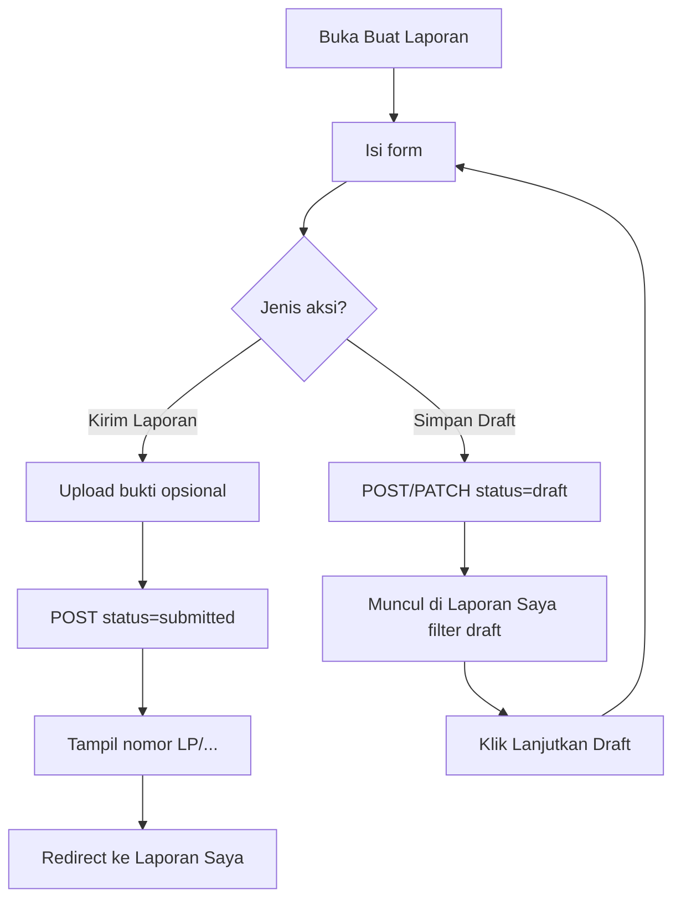

**Field form laporan:**

| Field | Wajib | Keterangan |
|-------|:-----:|------------|
| Nama pelapor | ✅ | Pre-fill dari profil |
| NIK | ✅ | |
| Telepon | ✅ | |
| Jenis kasus | ✅ | Kehilangan, Pencurian, Penipuan, dll. |
| Tanggal kejadian | ✅ | Date picker |
| Lokasi | ✅ | |
| Uraian | ✅ | Textarea |
| Bukti | ❌ | JPG/PNG/PDF, max 5MB per file |

**Jenis kasus** (`caseTypes`): Kehilangan, Pencurian, Penipuan, Kecelakaan Lalu Lintas, Kekerasan, Narkoba, Penganiayaan, Lainnya.

### 9.4 Proses petugas — OfficerDashboard

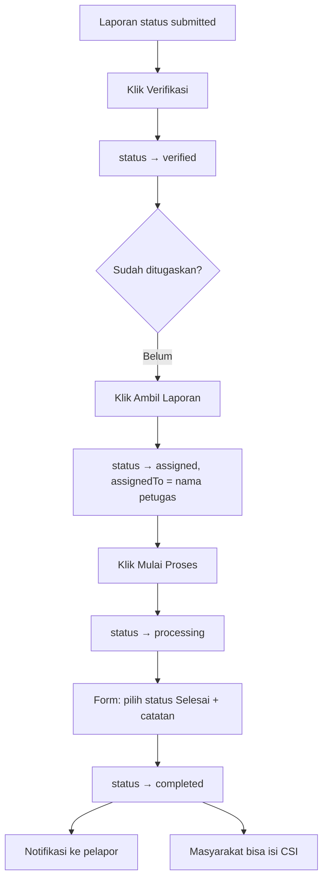

**Filter daftar di dashboard petugas:**

| Tab/Section | Kriteria |
|-------------|----------|
| Belum ditugaskan | `submitted` atau `verified`, tanpa `assignedTo` |
| Ditugaskan ke saya | `assignedTo === nama petugas login` |
| Sedang diproses | status `processing` |
| Selesai | status `completed` |

### 9.5 Timeline laporan

Setiap perubahan status penting menambah baris di `report_timeline`:

| Event | Contoh label timeline |
|-------|----------------------|
| Kirim | Laporan dikirim |
| Verifikasi | Diverifikasi |
| Assign | Ditugaskan |
| Proses | Diproses |
| Selesai | Selesai |

Masyarakat melihat timeline di popup detail **Laporan Saya**.

### 9.6 Admin — Semua Laporan (AdminControl)

| Aksi | Deskripsi | API |
|------|-----------|-----|
| **Override status** | Ubah status ke nilai apa pun + alasan wajib | `PATCH /reports/:id` + `adminOverride: true` |
| **Reassign** | Tugaskan ulang ke petugas lain | `PATCH` dengan `assignedTo`, status `assigned` |
| **Suspend user** | Nonaktifkan akun pelapor (by NIK) | `spktApi.suspendUserByNik` |

---

## 10. Flow Layanan Surat (Detail)

### 10.1 State machine

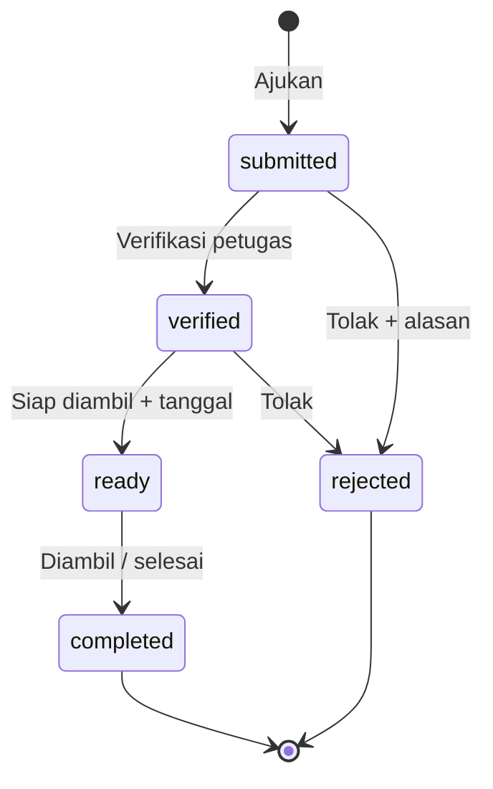

### 10.2 Jenis surat tersedia

| ID | Nama | Prefix nomor |
|----|------|--------------|
| `skck` | SKCK (Surat Keterangan Catatan Kepolisian) | SKCK |
| `kehilangan` | Surat Keterangan Kehilangan | SKH |
| `keramaian` | Izin Keramaian | IZIN |

### 10.3 Proses end-to-end

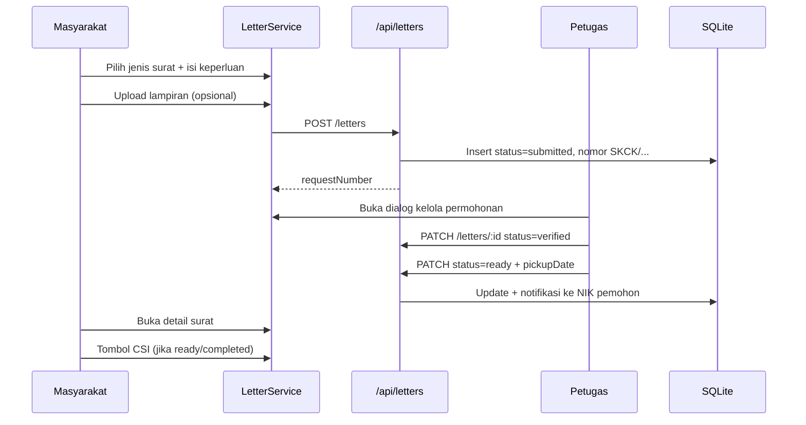

### 10.4 Label status surat

| Status | Label UI |
|--------|----------|
| `submitted` | Dikirim |
| `verified` | Diverifikasi |
| `ready` | Siap Diambil |
| `completed` | Selesai |
| `rejected` | Ditolak |

### 10.5 Syarat khusus petugas

| Status target | Field tambahan wajib |
|---------------|---------------------|
| `rejected` | Alasan penolakan (`rejectionReason`) |
| `ready` | Tanggal pengambilan (`pickupDate`) |

---

## 11. Flow Pengaduan (Detail)

### 11.1 State machine

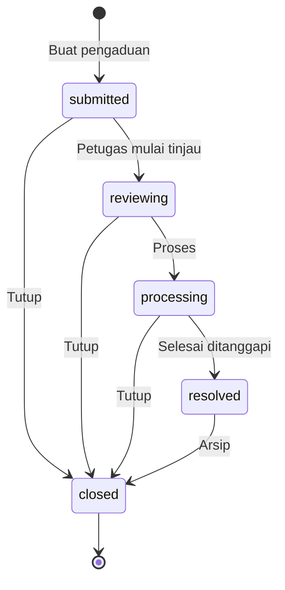

### 11.2 Kategori pengaduan

| Value | Label |
|-------|-------|
| `pelayanan` | Pelayanan |
| `petugas` | Petugas |
| `fasilitas` | Fasilitas |
| `sistem` | Sistem/Aplikasi |
| `lainnya` | Lainnya |

### 11.3 Proses masyarakat

1. Buka menu **Pengaduan** → klik **Buat Pengaduan Baru**
2. Popup form: kategori, subjek, detail, lampiran opsional
3. Submit → `POST /api/complaints` → status `submitted`
4. Pantau daftar + buka detail untuk lihat tanggapan petugas

### 11.4 Proses petugas/admin

Di popup detail pengaduan (role staff):

| Field | Fungsi |
|-------|--------|
| Select status | Ubah ke reviewing / processing / resolved / closed |
| Textarea tanggapan | Teks respon resmi |
| Simpan | `PATCH /api/complaints/:id` |

### 11.5 Label status pengaduan

| Status | Label UI |
|--------|----------|
| `submitted` | Terkirim |
| `reviewing` | Ditinjau |
| `processing` | Diproses |
| `resolved` | Selesai |
| `closed` | Ditutup |

### 11.6 CSI pengaduan

Tombol **Berikan Penilaian Kepuasan** muncul jika:

- User bukan staff (`!isStaff`)
- Status = `resolved` **atau** `closed`
- Belum pernah submit CSI untuk `complaintNumber` tersebut

---

## 12. Flow CSI — Kepuasan Masyarakat (Detail)

### 12.1 Tujuan penelitian

Mengukur **Customer Satisfaction Index (CSI)** setelah masyarakat menggunakan layanan SPKT, dengan rekap agregat untuk admin.

### 12.2 Kapan CSI tersedia

| Layanan | Syarat status | Komponen UI | `serviceType` |
|---------|---------------|-------------|---------------|
| Laporan | `completed` | MyReports → detail | `report` |
| Surat | `ready` atau `completed` | LetterService → detail | `letter` |
| Pengaduan | `resolved` atau `closed` | Complaints → detail | `complaint` |

### 12.3 Mekanisme UI (bukan popup otomatis)

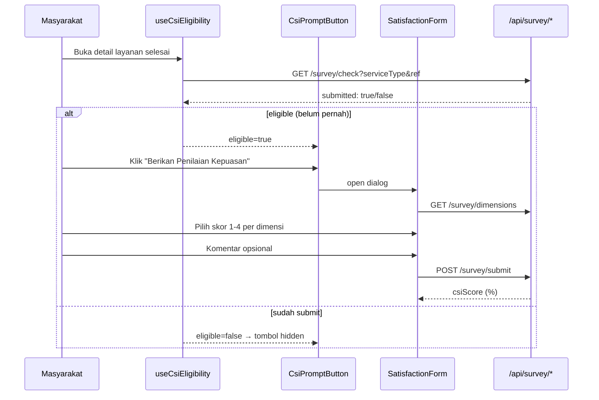

### 12.4 Lima dimensi penilaian

| # | Kode | Nama | Bobot |
|---|------|------|-------|
| 1 | ease | Kemudahan Prosedur | 1 |
| 2 | speed | Kecepatan Pelayanan | 1 |
| 3 | officer | Keramahan Petugas | 1 |
| 4 | clarity | Kejelasan Informasi | 1 |
| 5 | quality | Kualitas Hasil Layanan | 1 |

### 12.5 Skala skor

| Skor | Label |
|------|-------|
| 1 | Tidak Puas |
| 2 | Kurang Puas |
| 3 | Puas |
| 4 | Sangat Puas |

### 12.6 Rumus & contoh perhitungan

```
CSI = (Σ bobotᵢ × skorᵢ) / (Σ bobotᵢ × skor_maks) × 100%
```

Dengan skor_maks = 4 dan bobot semua = 1:

**Contoh:** Masyarakat memberi skor [4, 3, 4, 3, 4]

```
Σ(bobot × skor) = 4+3+4+3+4 = 18
Σ(bobot × 4)     = 5 × 4 = 20
CSI = (18/20) × 100 = 90%
```

Implementasi: `submitSurvey()` di `src/lib/csi.ts`

### 12.7 Aturan bisnis CSI

| Aturan | Detail |
|--------|--------|
| Satu survei per layanan | Unik per `(user_id, service_type, reference_id)` |
| Wajib lengkap | Semua 5 dimensi harus diisi |
| Duplikat | API menolak jika sudah pernah submit |
| Penyimpanan | `satisfaction_surveys` + `survey_responses` |

### 12.8 Dashboard admin CSI

Menu: **Kepuasan (CSI)** → `AdminCSI.tsx`

| Widget | Sumber data |
|--------|-------------|
| KPI CSI keseluruhan | `overall.averageCsi` |
| Total responden | `overall.totalResponses` |
| CSI min / max | `overall.minCsi`, `maxCsi` |
| Chart bar per layanan | `byService[]` |
| Chart bar per dimensi | `byDimension[]` |
| Line chart tren bulanan | `monthly[]` |
| Tabel penilaian terbaru | `GET /survey/recent` |

API: `GET /api/survey/csi/summary`

---

## 13. Flow Notifikasi

### 13.1 Diagram

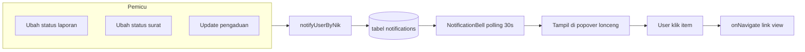

### 13.2 Jenis notifikasi

| type | Judul | Pemicu | link (navigasi) |
|------|-------|--------|-----------------|
| `report_status` | Status Laporan Diperbarui | Status laporan berubah | `my-reports` |
| `letter_status` | Status Surat Diperbarui | Status surat berubah | `letter-service` |
| `complaint_update` | Pengaduan Ditanggapi | Status/tanggapan pengaduan berubah | `complaints` |

Notifikasi hanya dikirim jika NIK pelapor cocok dengan user terdaftar di tabel `users`.

### 13.3 Interaksi user

| Aksi | Endpoint |
|------|----------|
| Lihat daftar | `GET /api/notifications` |
| Tandai satu dibaca | `PATCH /api/notifications/:id` |
| Tandai semua dibaca | via `spktApi.markAllNotificationsRead()` |
| Preferensi saluran | `GET/PATCH /api/users/me/preferences` |

---

## 14. Flow Admin & Manajemen

### 14.1 User Management

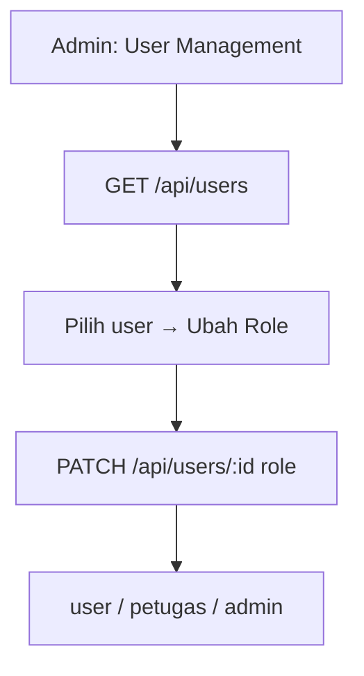

### 14.2 Kelola Petugas

| Aksi | Endpoint |
|------|----------|
| Lihat daftar | `GET /api/officers` |
| Tambah petugas | `POST /api/officers` |
| Ubah status (available/busy/offline) | `PATCH /api/officers/:id` |

Form tambah: nama, pangkat, email, telepon.

### 14.3 Statistik Admin

`AdminStatistics` → `GET /api/stats/admin`

Menampilkan agregat: jumlah laporan per status, surat, pengaduan, dll.

### 14.4 Admin Control vs Officer Dashboard

| Aspek | OfficerDashboard | AdminControl |
|-------|------------------|--------------|
| Role | petugas | admin |
| Scope | Proses laporan step-by-step | Semua laporan + override |
| Override | ❌ | ✅ dengan alasan |
| Reassign | ❌ | ✅ ke petugas lain |

---

## 15. Upload File & Lampiran

### 15.1 Sequence

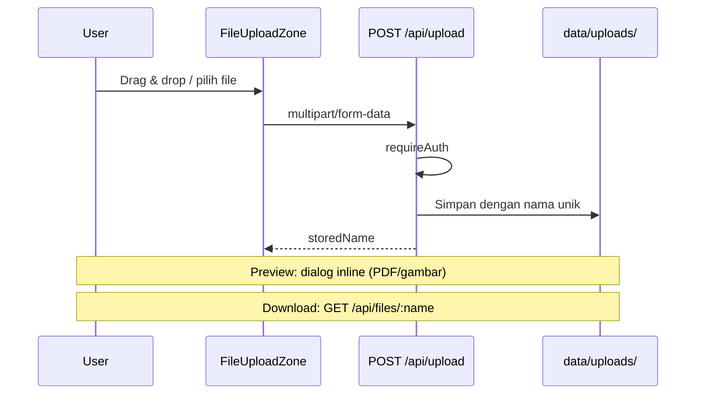

### 15.2 Aturan upload

| Aturan | Nilai |
|--------|-------|
| Format | PNG, JPG, PDF (dan gambar umum) |
| Ukuran max | 5 MB per file (configurable di komponen) |
| Auth download | Wajib login (`requireAuth`) |
| Path fisik | `UPLOAD_DIR` atau `data/uploads/` |

Digunakan di: bukti laporan, lampiran surat, lampiran pengaduan.

---

## 16. Informasi, Pengaturan & Preferensi

### 16.1 Informasi

- API: `GET /api/info/articles`
- Tabel: `info_articles` (seed: panduan laporan, SKCK, tips keamanan, dll.)
- UI: `Information.tsx` — kartu artikel per kategori

### 16.2 Pengaturan profil

| Fitur | Endpoint | Keterangan |
|-------|----------|------------|
| Lihat profil | `GET /api/users/me` | |
| Update nama, telepon, alamat | `PATCH /api/users/me` | Email & NIK readonly di UI |
| Ganti password | `POST /api/users/me/password` | |
| Preferensi | `GET/PATCH /api/users/me/preferences` | JSON di kolom `preferences_json` |

### 16.3 Preferensi (contoh)

Disimpan sebagai JSON di database:

- Notifikasi email/push (toggle UI)
- Tema gelap (`spkt-light` class di `<html>`)

---

## 17. Model Data & Tabel Database

### 17.1 ERD

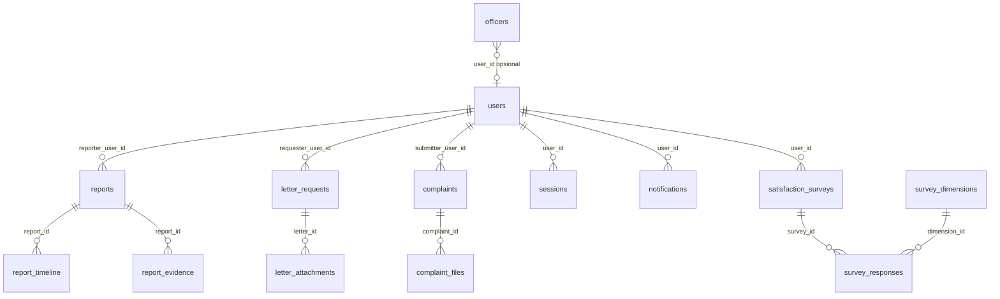

### 17.2 Daftar tabel

| Tabel | Fungsi |
|-------|--------|
| `users` | Akun login, role, NIK, preferensi |
| `sessions` | Token session aktif |
| `officers` | Data petugas lapangan |
| `reports` | Laporan polisi |
| `report_timeline` | Riwayat status laporan |
| `report_evidence` | Nama file bukti |
| `letter_requests` | Permohonan surat |
| `letter_attachments` | Lampiran surat |
| `complaints` | Pengaduan |
| `complaint_files` | Lampiran pengaduan |
| `notifications` | Notifikasi in-app |
| `reference_counters` | Penomoran otomatis |
| `survey_dimensions` | 5 dimensi CSI |
| `satisfaction_surveys` | Header survei + skor CSI |
| `survey_responses` | Skor per dimensi |
| `info_articles` | Artikel informasi |

---

## 18. Kontrak API (Ringkas per Role)

Detail lengkap: [`docs/API.md`](API.md)

### Endpoint publik / auth

| Method | Path | Auth |
|--------|------|------|
| POST | `/auth/login` | ❌ |
| POST | `/auth/register` | ❌ |
| GET | `/auth/session` | cookie |
| POST | `/auth/logout` | cookie |

### Endpoint dengan role

| Path | user | petugas | admin |
|------|:----:|:-------:|:-----:|
| `/reports` GET | own NIK | all | all |
| `/reports` POST | ✅ | ❌ | ❌ |
| `/reports/:id` PATCH | draft only | proses | proses + override |
| `/letters` POST | ✅ | ❌ | ❌ |
| `/letters/:id` PATCH | ❌ | ✅ | ✅ |
| `/complaints` POST | ✅ | ❌ | ❌ |
| `/complaints/:id` PATCH | ❌ | ✅ | ✅ |
| `/survey/submit` | ✅ | ❌ | ❌ |
| `/survey/csi/summary` | ❌ | ❌ | ✅ |
| `/users` | ❌ | ❌ | ✅ |
| `/officers` POST | ❌ | ❌ | ✅ |
| `/stats/admin` | ❌ | ❌ | ✅ |

---

## 19. Deploy, Environment & Build

### 19.1 Environment variables

| Variable | Default | Keterangan |
|----------|---------|------------|
| `DATA_DIR` | `./data` | Folder DB + upload |
| `DATABASE_PATH` | `DATA_DIR/spkt.db` | Path SQLite |
| `UPLOAD_DIR` | `DATA_DIR/uploads` | File lampiran |

### 19.2 Railway / production

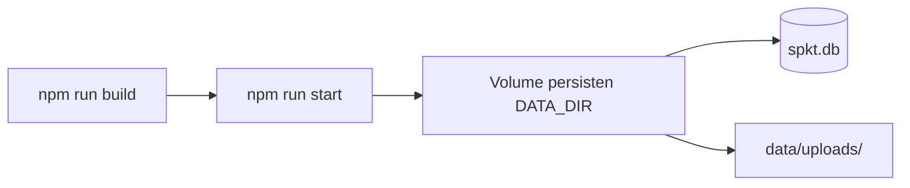

| Check | URL |
|-------|-----|
| Healthcheck | `GET /api/health` → `{ status: "ok" }` |

**Penting:** Tanpa volume persisten, data hilang saat redeploy.

### 19.3 Build vs runtime

| Fase | Perilaku SQLite |
|------|-----------------|
| `next build` | Koneksi **dilewati** (hindari database locked) |
| `next start` / runtime | DB aktif, init on first API call |

---

## 20. Skenario Uji Lengkap (Penelitian)

### 20.1 Skenario A — Laporan + CSI (utama)

| Step | Actor | Aksi | Hasil yang diharapkan |
|------|-------|------|------------------------|
| 1 | Masyarakat | Login `user@spkt.id` | Dashboard masyarakat |
| 2 | Masyarakat | Buat Laporan → Kirim | Nomor LP/... status Dikirim |
| 3 | Petugas | Login → Laporan Masuk → Verifikasi | Status Diverifikasi + notifikasi |
| 4 | Petugas | Ambil Laporan | Status Ditugaskan |
| 5 | Petugas | Mulai Proses | Status Diproses |
| 6 | Petugas | Update → Selesai | Status Selesai + notifikasi |
| 7 | Masyarakat | Laporan Saya → detail → CSI | Form 5 dimensi |
| 8 | Masyarakat | Submit penilaian | Toast skor CSI % |
| 9 | Admin | Kepuasan CSI | Chart & tabel terupdate |

### 20.2 Skenario B — Surat + CSI

1. Masyarakat ajukan SKCK → `submitted`
2. Petugas verifikasi → `verified`
3. Petugas set `ready` + tanggal ambil
4. Masyarakat detail surat → isi CSI
5. Admin lihat CSI per layanan "Layanan Surat"

### 20.3 Skenario C — Pengaduan + CSI

1. Masyarakat buat pengaduan kategori Sistem
2. Petugas ubah ke `processing`, isi tanggapan
3. Petugas set `resolved`
4. Masyarakat isi CSI di detail pengaduan

### 20.4 Skenario D — Admin override

1. Admin buka Semua Laporan
2. Pilih laporan stuck di `submitted`
3. Override ke `processing` dengan alasan
4. Verifikasi timeline + notifikasi pelapor

---

## 21. Referensi File Kode

| Topik | File |
|-------|------|
| Entry SPA | `src/app/page.tsx`, `DashboardApp.tsx` |
| Menu & routing | `Sidebar.tsx` |
| Auth client | `AuthContext.tsx` |
| Auth server | `auth-server.ts` |
| Client HTTP | `spktApi.ts`, `surveyApi.ts` |
| Transisi status | `status-transitions.ts` |
| Logika laporan/surat/pengaduan | `services/spkt.ts` |
| Notifikasi | `services/notifications.ts` |
| Nomor referensi | `reference.ts` |
| CSI | `csi.ts`, `SatisfactionForm.tsx`, `CsiPromptButton.tsx` |
| Eligibility CSI | `hooks/useCsiEligibility.ts` |
| Database | `db.ts` |
| Admin CSI charts | `AdminCSI.tsx` |
| API docs | `docs/API.md` |
| Flow ringkas | `docs/FLOW.md` |

---

## Lampiran: Alur Data CSI ke Admin (Penelitian)

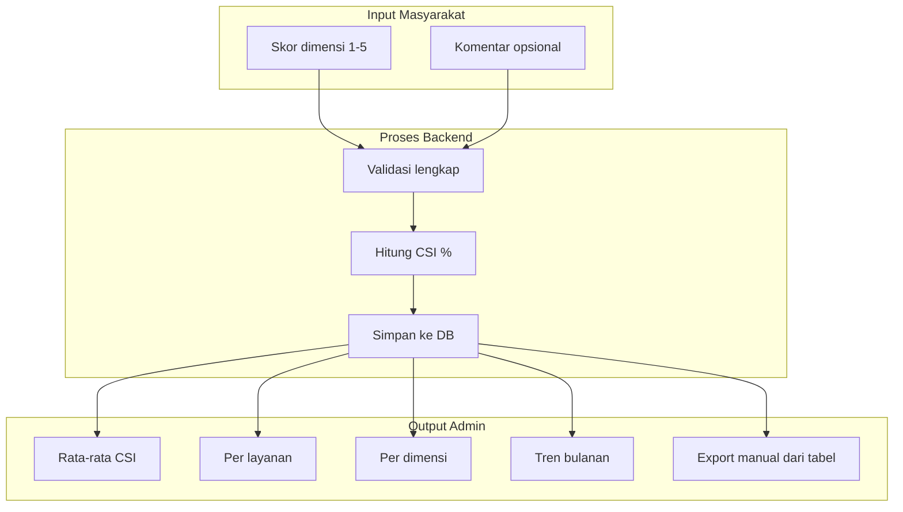

---

*Dokumen ini menjelaskan flow dan proses aplikasi SPKT Digital sesuai implementasi kode terkini. Untuk perubahan fitur, bandingkan dengan file referensi di Bagian 20.*
